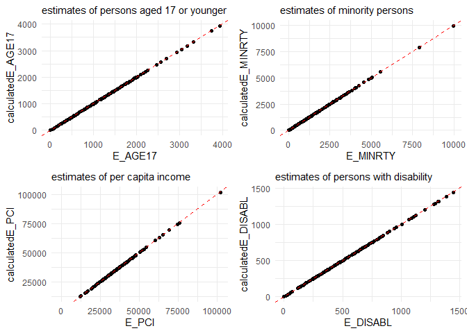
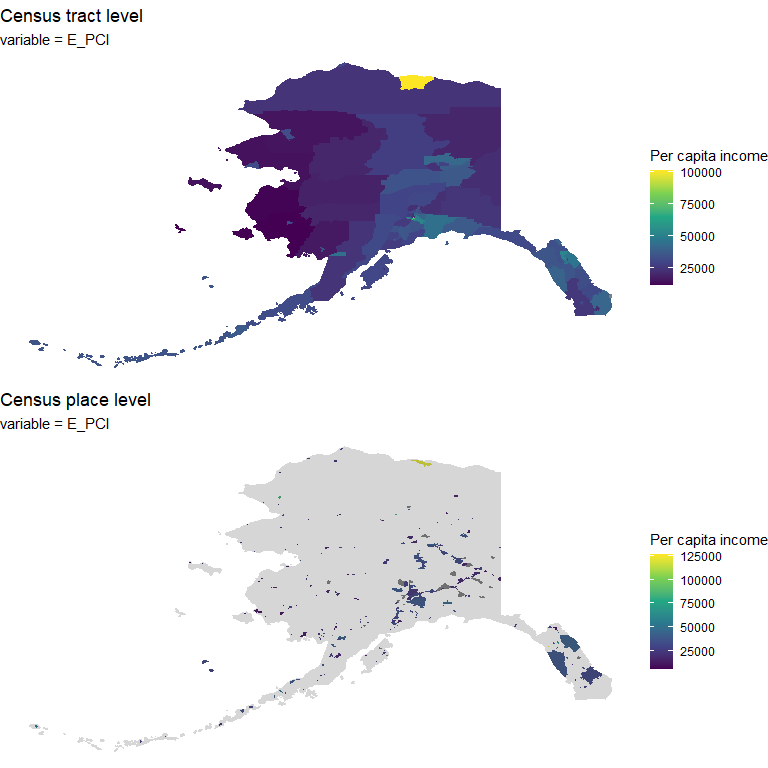
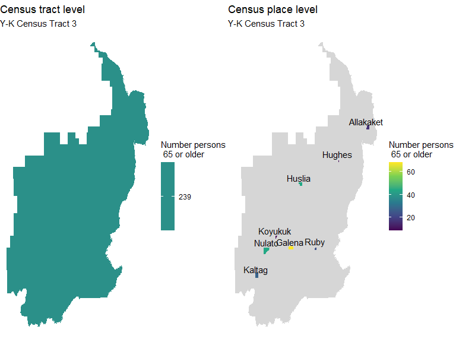
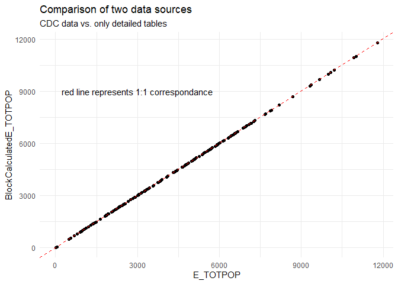
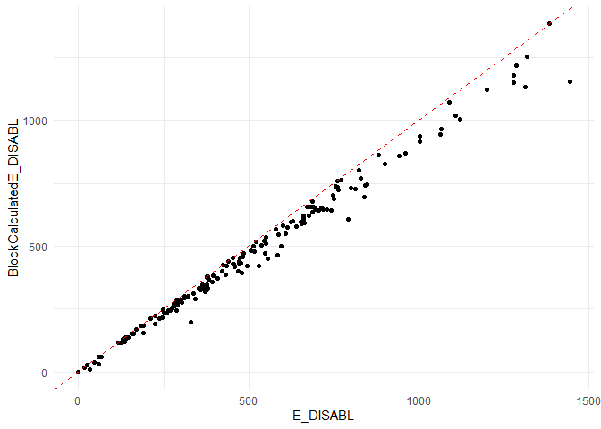
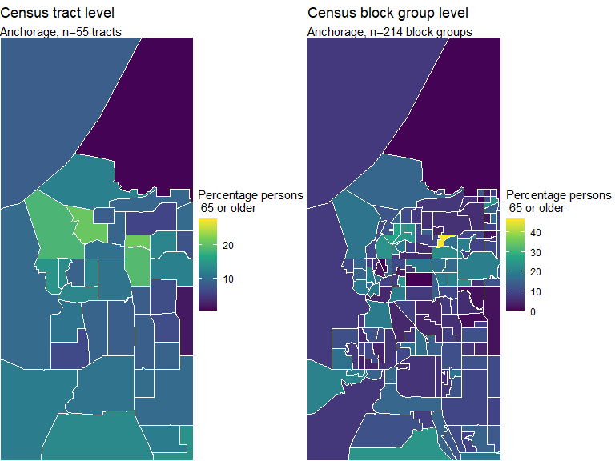

SVI Data for Multiple Geographies
================
John Harley
5/6/2020

# Background

Social vulnerability is the measure of a state, region, or communities
vulnerability to disease, environmental disaster, or other stressors on
human health. The U.S. Centers for Disease Control and Prevention (CDC)
calculates a Social Vulnerability Index (SVI) based on U.S. census
variables.

Variables that are included in the SVI calculations are downloaded from
the American Community Survey (ACS) which is a program run by the Census
Bureau providing detailed population and housing data. The ACS conducts
yearly surveys (ACS 1-year) for most geogrpahies, but data for smaller
geographies (\<65,000 people) data are summarized in 5-year reports (ACS
5-year). The most recently published ACS 5-year report was data
aggregated from 2014-2018, published in December of 2019.

## Geographies

Throughout the document I will be refering to various census
geographies, a hierarchy of which for the ACS is shown here (from
[census.gov](census.gov)).

<center>

**ACS Geographies**


</center>

The CDC calculates the SVI for a number of geographies down to census
tract (usually 2,500 - 8,000 people). In Alaska, these data are
displayed across census tracts as a Heilth Equity Index (HEI) by the
DHSS in an interactive
[storymap](https://alaska-dhss.maps.arcgis.com/apps/MapSeries/index.html?appid=0c844d89ebba428d94bbf552d6e7ea24).

I’ve made a table of the various Alaska geographies below for reference.

## Variables

The variables that are used in the SVI calculation fall in to four broad
domains (figure from ESRI).

<center>

**SVI Variables**


</center>

These values are extracted from ACS tables, and generally converted into
a percentage format (i.e. Percent of persons living below poverty). Then
percent rankings are derived for each variable and GEOID. So GEOIDs with
higher percentage of people living in poverty will have a ranking closer
to 1. Aggregate domain and overall rankings are calculated and flags are
given to GEOIDs in the 90th percentile (most vulnerable). A
comprehensive description of the SVI methodology is described
[here](https://svi.cdc.gov/Documents/Data/2018_SVI_Data/SVI2018Documentation.pdf).

# Reproducing SVI calculations

The SVI documentation linked above describes in detail the methodology
for accessing and calculating each variable estimate and a margin of
error (MOE). These calculations generaly reference specific ACS tables
which include non-descript variable names such as “S0101\_C01\_030E”,
which is actually the number of persons aged 65 and older. The SVI
renames variables to a more interpretable title, the shorthand for that
particular variable is called “E\_AGE6”.

More complex calculations occur, such as the number of minority persons
which is:

\(Minority = Total population - White, Non-Hispanic\)

All of these calculations are well documented and are reproduced in the
.csv file in the data folder called
[SVI\_Variables](https://github.com/johnrharley/alaskaSVI/blob/master/data/SVI_Variables.csv).
Formulae for calculating variables and MOEs are provivided in respective
columns in formats that can be interpreted by R using the
`parse_exprs()` command from `rlang`.

In this way we can calculate SVIs for multiple geographies, including
some not done by the CDC. In this repo you’ll find a set of functions
which are designed to extract data from the ACS tables and calculate
SVIs for a given state and geomerty. These functions are split into
several steps including accessing the raw estimates
(`get_SVI_values()`), accessing and calculating percentages
(`get_SVI_percentages()`), and then calculating percent rankings and
flags (`SVI_rankings()` and `SVI_flags()`).

For convenience, the workflow is also wrapped in the function
`get_all_SVI()` to which you can pass a state and geometry. This
function returns a table of 114 variables including the GEOID (unique ID
for each region) the name and the SVI variables. A small sample of which
is shown below.

``` r
AlaskaTract <- get_all_SVI(state = "AK", geography = "tract") 

head(AlaskaTract) %>%
  knitr::kable(., caption="Output from get_all_SVI()") %>%
  kable_styling(latex_options = "striped", position="center", full_width = FALSE)
```

<table class="table" style="width: auto !important; margin-left: auto; margin-right: auto;">

<caption>

Output from get\_all\_SVI()

</caption>

<thead>

<tr>

<th style="text-align:left;">

GEOID

</th>

<th style="text-align:left;">

NAME

</th>

<th style="text-align:right;">

E\_AGE17

</th>

<th style="text-align:right;">

M\_AGE17

</th>

<th style="text-align:right;">

E\_POV

</th>

<th style="text-align:right;">

M\_POV

</th>

<th style="text-align:right;">

E\_PCI

</th>

<th style="text-align:right;">

M\_PCI

</th>

<th style="text-align:right;">

E\_NOHSDP

</th>

<th style="text-align:right;">

M\_NOHSDP

</th>

<th style="text-align:right;">

E\_GROUPQ

</th>

<th style="text-align:right;">

M\_GROUPQ

</th>

<th style="text-align:right;">

E\_AGE65

</th>

<th style="text-align:right;">

M\_AGE65

</th>

<th style="text-align:right;">

E\_TOTPOP

</th>

<th style="text-align:right;">

M\_TOTPOP

</th>

<th style="text-align:right;">

E\_DISABL

</th>

<th style="text-align:right;">

M\_DISABL

</th>

<th style="text-align:right;">

E\_UNEMP

</th>

<th style="text-align:right;">

M\_UNEMP

</th>

<th style="text-align:right;">

E\_HU

</th>

<th style="text-align:right;">

M\_HU

</th>

<th style="text-align:right;">

E\_HH

</th>

<th style="text-align:right;">

M\_HH

</th>

<th style="text-align:right;">

E\_MOBILE

</th>

<th style="text-align:right;">

M\_MOBILE

</th>

<th style="text-align:right;">

E\_NOVEH

</th>

<th style="text-align:right;">

M\_NOVEH

</th>

<th style="text-align:right;">

E\_SNGPNT

</th>

<th style="text-align:right;">

E\_MINRTY

</th>

<th style="text-align:right;">

E\_LIMENG

</th>

<th style="text-align:right;">

E\_MUNIT

</th>

<th style="text-align:right;">

E\_CROWD

</th>

<th style="text-align:right;">

M\_SNGPNT

</th>

<th style="text-align:right;">

M\_MINRTY

</th>

<th style="text-align:right;">

M\_LIMENG

</th>

<th style="text-align:right;">

M\_MUNIT

</th>

<th style="text-align:right;">

M\_CROWD

</th>

<th style="text-align:right;">

EP\_PCI

</th>

<th style="text-align:right;">

MP\_PCI

</th>

<th style="text-align:right;">

EP\_POV

</th>

<th style="text-align:right;">

MP\_POV

</th>

<th style="text-align:right;">

EP\_NOHSDP

</th>

<th style="text-align:right;">

MP\_NOHSDP

</th>

<th style="text-align:right;">

EP\_AGE65

</th>

<th style="text-align:right;">

MP\_AGE65

</th>

<th style="text-align:right;">

EP\_UNEMP

</th>

<th style="text-align:right;">

MP\_UNEMP

</th>

<th style="text-align:right;">

EP\_DISABL

</th>

<th style="text-align:right;">

MP\_DISABL

</th>

<th style="text-align:right;">

EP\_MOBILE

</th>

<th style="text-align:right;">

MP\_MOBILE

</th>

<th style="text-align:right;">

EP\_NOVEH

</th>

<th style="text-align:right;">

MP\_NOVEH

</th>

<th style="text-align:right;">

EP\_AGE17

</th>

<th style="text-align:right;">

EP\_SNGPNT

</th>

<th style="text-align:right;">

EP\_MINRTY

</th>

<th style="text-align:right;">

EP\_LIMENG

</th>

<th style="text-align:right;">

EP\_MUNIT

</th>

<th style="text-align:right;">

EP\_CROWD

</th>

<th style="text-align:right;">

EP\_GROUPQ

</th>

<th style="text-align:right;">

MP\_AGE17

</th>

<th style="text-align:right;">

MP\_SNGPNT

</th>

<th style="text-align:right;">

MP\_MINRTY

</th>

<th style="text-align:right;">

MP\_LIMENG

</th>

<th style="text-align:right;">

MP\_MUNIT

</th>

<th style="text-align:right;">

MP\_CROWD

</th>

<th style="text-align:right;">

MP\_GROUPQ

</th>

<th style="text-align:left;">

POP\_GROUP

</th>

<th style="text-align:right;">

EPL\_PCI

</th>

<th style="text-align:right;">

EPL\_POV

</th>

<th style="text-align:right;">

EPL\_NOHSDP

</th>

<th style="text-align:right;">

EPL\_AGE65

</th>

<th style="text-align:right;">

EPL\_UNEMP

</th>

<th style="text-align:right;">

EPL\_DISABL

</th>

<th style="text-align:right;">

EPL\_MOBILE

</th>

<th style="text-align:right;">

EPL\_NOVEH

</th>

<th style="text-align:right;">

EPL\_AGE17

</th>

<th style="text-align:right;">

EPL\_SNGPNT

</th>

<th style="text-align:right;">

EPL\_MINRTY

</th>

<th style="text-align:right;">

EPL\_LIMENG

</th>

<th style="text-align:right;">

EPL\_MUNIT

</th>

<th style="text-align:right;">

EPL\_CROWD

</th>

<th style="text-align:right;">

EPL\_GROUPQ

</th>

<th style="text-align:right;">

SPL\_THEME1

</th>

<th style="text-align:right;">

RPL\_THEME1

</th>

<th style="text-align:right;">

SPL\_THEME2

</th>

<th style="text-align:right;">

RPL\_THEME2

</th>

<th style="text-align:right;">

SPL\_THEME3

</th>

<th style="text-align:right;">

RPL\_THEME3

</th>

<th style="text-align:right;">

SPL\_THEME4

</th>

<th style="text-align:right;">

RPL\_THEME4

</th>

<th style="text-align:right;">

SPL\_THEMES

</th>

<th style="text-align:right;">

RPL\_THEMES

</th>

<th style="text-align:right;">

F\_PCI

</th>

<th style="text-align:right;">

F\_POV

</th>

<th style="text-align:right;">

F\_NOHSDP

</th>

<th style="text-align:right;">

F\_AGE65

</th>

<th style="text-align:right;">

F\_UNEMP

</th>

<th style="text-align:right;">

F\_DISABL

</th>

<th style="text-align:right;">

F\_MOBILE

</th>

<th style="text-align:right;">

F\_NOVEH

</th>

<th style="text-align:right;">

F\_AGE17

</th>

<th style="text-align:right;">

F\_SNGPNT

</th>

<th style="text-align:right;">

F\_MINRTY

</th>

<th style="text-align:right;">

F\_LIMENG

</th>

<th style="text-align:right;">

F\_MUNIT

</th>

<th style="text-align:right;">

F\_CROWD

</th>

<th style="text-align:right;">

F\_GROUPQ

</th>

<th style="text-align:right;">

F\_THEME1

</th>

<th style="text-align:right;">

F\_THEME2

</th>

<th style="text-align:right;">

F\_THEME3

</th>

<th style="text-align:right;">

F\_THEME4

</th>

<th style="text-align:right;">

F\_THEMES

</th>

</tr>

</thead>

<tbody>

<tr>

<td style="text-align:left;">

02013000100

</td>

<td style="text-align:left;">

Census Tract 1, Aleutians East Borough, Alaska

</td>

<td style="text-align:right;">

488

</td>

<td style="text-align:right;">

78

</td>

<td style="text-align:right;">

525

</td>

<td style="text-align:right;">

95

</td>

<td style="text-align:right;">

32510

</td>

<td style="text-align:right;">

2080

</td>

<td style="text-align:right;">

358

</td>

<td style="text-align:right;">

83

</td>

<td style="text-align:right;">

1189

</td>

<td style="text-align:right;">

318

</td>

<td style="text-align:right;">

302

</td>

<td style="text-align:right;">

54

</td>

<td style="text-align:right;">

3425

</td>

<td style="text-align:right;">

NA

</td>

<td style="text-align:right;">

291

</td>

<td style="text-align:right;">

54

</td>

<td style="text-align:right;">

87

</td>

<td style="text-align:right;">

27

</td>

<td style="text-align:right;">

1106

</td>

<td style="text-align:right;">

142

</td>

<td style="text-align:right;">

860

</td>

<td style="text-align:right;">

141

</td>

<td style="text-align:right;">

48

</td>

<td style="text-align:right;">

15

</td>

<td style="text-align:right;">

198

</td>

<td style="text-align:right;">

39

</td>

<td style="text-align:right;">

121

</td>

<td style="text-align:right;">

2910

</td>

<td style="text-align:right;">

434

</td>

<td style="text-align:right;">

42

</td>

<td style="text-align:right;">

22

</td>

<td style="text-align:right;">

25.49510

</td>

<td style="text-align:right;">

3426.0546

</td>

<td style="text-align:right;">

116.24113

</td>

<td style="text-align:right;">

16.64332

</td>

<td style="text-align:right;">

15.00000

</td>

<td style="text-align:right;">

32510

</td>

<td style="text-align:right;">

2080

</td>

<td style="text-align:right;">

15.4

</td>

<td style="text-align:right;">

2.8

</td>

<td style="text-align:right;">

13.6

</td>

<td style="text-align:right;">

3.2

</td>

<td style="text-align:right;">

8.8

</td>

<td style="text-align:right;">

1.6

</td>

<td style="text-align:right;">

3.5

</td>

<td style="text-align:right;">

1.2

</td>

<td style="text-align:right;">

8.5

</td>

<td style="text-align:right;">

1.6

</td>

<td style="text-align:right;">

4.3

</td>

<td style="text-align:right;">

1.3

</td>

<td style="text-align:right;">

23.0

</td>

<td style="text-align:right;">

2.7

</td>

<td style="text-align:right;">

14.24818

</td>

<td style="text-align:right;">

14.069767

</td>

<td style="text-align:right;">

84.96350

</td>

<td style="text-align:right;">

13.0841121

</td>

<td style="text-align:right;">

3.797468

</td>

<td style="text-align:right;">

2.5581395

</td>

<td style="text-align:right;">

34.7153285

</td>

<td style="text-align:right;">

NA

</td>

<td style="text-align:right;">

NA

</td>

<td style="text-align:right;">

3.5031265

</td>

<td style="text-align:right;">

1.423647

</td>

<td style="text-align:right;">

1.423647

</td>

<td style="text-align:right;">

1.693008

</td>

<td style="text-align:right;">

NA

</td>

<td style="text-align:left;">

More than 1,000 persons

</td>

<td style="text-align:right;">

0.5870968

</td>

<td style="text-align:right;">

0.7612903

</td>

<td style="text-align:right;">

0.8967742

</td>

<td style="text-align:right;">

0.3032258

</td>

<td style="text-align:right;">

0.1483871

</td>

<td style="text-align:right;">

0.1677419

</td>

<td style="text-align:right;">

0.5974026

</td>

<td style="text-align:right;">

0.8766234

</td>

<td style="text-align:right;">

0.0387097

</td>

<td style="text-align:right;">

0.8129032

</td>

<td style="text-align:right;">

0.9290323

</td>

<td style="text-align:right;">

0.9935484

</td>

<td style="text-align:right;">

0.5290323

</td>

<td style="text-align:right;">

0.2193548

</td>

<td style="text-align:right;">

0.9935484

</td>

<td style="text-align:right;">

310.5935

</td>

<td style="text-align:right;">

0

</td>

<td style="text-align:right;">

309.9935

</td>

<td style="text-align:right;">

0

</td>

<td style="text-align:right;">

155.0129

</td>

<td style="text-align:right;">

0

</td>

<td style="text-align:right;">

382.4475

</td>

<td style="text-align:right;">

0

</td>

<td style="text-align:right;">

180655.418

</td>

<td style="text-align:right;">

0

</td>

<td style="text-align:right;">

0

</td>

<td style="text-align:right;">

0

</td>

<td style="text-align:right;">

0

</td>

<td style="text-align:right;">

0

</td>

<td style="text-align:right;">

0

</td>

<td style="text-align:right;">

0

</td>

<td style="text-align:right;">

0

</td>

<td style="text-align:right;">

0

</td>

<td style="text-align:right;">

0

</td>

<td style="text-align:right;">

0

</td>

<td style="text-align:right;">

1

</td>

<td style="text-align:right;">

1

</td>

<td style="text-align:right;">

0

</td>

<td style="text-align:right;">

0

</td>

<td style="text-align:right;">

1

</td>

<td style="text-align:right;">

0

</td>

<td style="text-align:right;">

0

</td>

<td style="text-align:right;">

2

</td>

<td style="text-align:right;">

1

</td>

<td style="text-align:right;">

3

</td>

</tr>

<tr>

<td style="text-align:left;">

02016000100

</td>

<td style="text-align:left;">

Census Tract 1, Aleutians West Census Area, Alaska

</td>

<td style="text-align:right;">

175

</td>

<td style="text-align:right;">

38

</td>

<td style="text-align:right;">

131

</td>

<td style="text-align:right;">

45

</td>

<td style="text-align:right;">

35418

</td>

<td style="text-align:right;">

7374

</td>

<td style="text-align:right;">

47

</td>

<td style="text-align:right;">

14

</td>

<td style="text-align:right;">

252

</td>

<td style="text-align:right;">

127

</td>

<td style="text-align:right;">

97

</td>

<td style="text-align:right;">

17

</td>

<td style="text-align:right;">

969

</td>

<td style="text-align:right;">

132

</td>

<td style="text-align:right;">

138

</td>

<td style="text-align:right;">

26

</td>

<td style="text-align:right;">

18

</td>

<td style="text-align:right;">

12

</td>

<td style="text-align:right;">

792

</td>

<td style="text-align:right;">

47

</td>

<td style="text-align:right;">

218

</td>

<td style="text-align:right;">

44

</td>

<td style="text-align:right;">

0

</td>

<td style="text-align:right;">

9

</td>

<td style="text-align:right;">

79

</td>

<td style="text-align:right;">

17

</td>

<td style="text-align:right;">

27

</td>

<td style="text-align:right;">

766

</td>

<td style="text-align:right;">

19

</td>

<td style="text-align:right;">

23

</td>

<td style="text-align:right;">

12

</td>

<td style="text-align:right;">

13.03840

</td>

<td style="text-align:right;">

973.3576

</td>

<td style="text-align:right;">

33.67492

</td>

<td style="text-align:right;">

12.72792

</td>

<td style="text-align:right;">

7.28011

</td>

<td style="text-align:right;">

35418

</td>

<td style="text-align:right;">

7374

</td>

<td style="text-align:right;">

16.6

</td>

<td style="text-align:right;">

5.4

</td>

<td style="text-align:right;">

7.2

</td>

<td style="text-align:right;">

2.6

</td>

<td style="text-align:right;">

10.0

</td>

<td style="text-align:right;">

2.2

</td>

<td style="text-align:right;">

3.1

</td>

<td style="text-align:right;">

2.4

</td>

<td style="text-align:right;">

17.4

</td>

<td style="text-align:right;">

4.1

</td>

<td style="text-align:right;">

0.0

</td>

<td style="text-align:right;">

2.5

</td>

<td style="text-align:right;">

36.2

</td>

<td style="text-align:right;">

6.6

</td>

<td style="text-align:right;">

18.05986

</td>

<td style="text-align:right;">

12.385321

</td>

<td style="text-align:right;">

79.05057

</td>

<td style="text-align:right;">

2.0585049

</td>

<td style="text-align:right;">

2.904040

</td>

<td style="text-align:right;">

5.5045872

</td>

<td style="text-align:right;">

26.0061920

</td>

<td style="text-align:right;">

3.053896

</td>

<td style="text-align:right;">

99.87082

</td>

<td style="text-align:right;">

3.6370589

</td>

<td style="text-align:right;">

1.597794

</td>

<td style="text-align:right;">

1.597794

</td>

<td style="text-align:right;">

3.149270

</td>

<td style="text-align:right;">

12.6184262

</td>

<td style="text-align:left;">

100-1,000 persons

</td>

<td style="text-align:right;">

0.2500000

</td>

<td style="text-align:right;">

0.3750000

</td>

<td style="text-align:right;">

0.3750000

</td>

<td style="text-align:right;">

0.3750000

</td>

<td style="text-align:right;">

0.0000000

</td>

<td style="text-align:right;">

0.6250000

</td>

<td style="text-align:right;">

0.0000000

</td>

<td style="text-align:right;">

0.8750000

</td>

<td style="text-align:right;">

0.2500000

</td>

<td style="text-align:right;">

0.7500000

</td>

<td style="text-align:right;">

0.7500000

</td>

<td style="text-align:right;">

0.7500000

</td>

<td style="text-align:right;">

0.6250000

</td>

<td style="text-align:right;">

0.5000000

</td>

<td style="text-align:right;">

0.7500000

</td>

<td style="text-align:right;">

17.7500

</td>

<td style="text-align:right;">

0

</td>

<td style="text-align:right;">

17.6250

</td>

<td style="text-align:right;">

0

</td>

<td style="text-align:right;">

8.6250

</td>

<td style="text-align:right;">

0

</td>

<td style="text-align:right;">

22.1250

</td>

<td style="text-align:right;">

0

</td>

<td style="text-align:right;">

595.125

</td>

<td style="text-align:right;">

0

</td>

<td style="text-align:right;">

0

</td>

<td style="text-align:right;">

0

</td>

<td style="text-align:right;">

0

</td>

<td style="text-align:right;">

0

</td>

<td style="text-align:right;">

0

</td>

<td style="text-align:right;">

0

</td>

<td style="text-align:right;">

0

</td>

<td style="text-align:right;">

0

</td>

<td style="text-align:right;">

0

</td>

<td style="text-align:right;">

0

</td>

<td style="text-align:right;">

0

</td>

<td style="text-align:right;">

0

</td>

<td style="text-align:right;">

0

</td>

<td style="text-align:right;">

0

</td>

<td style="text-align:right;">

0

</td>

<td style="text-align:right;">

0

</td>

<td style="text-align:right;">

0

</td>

<td style="text-align:right;">

0

</td>

<td style="text-align:right;">

0

</td>

<td style="text-align:right;">

0

</td>

</tr>

<tr>

<td style="text-align:left;">

02016000200

</td>

<td style="text-align:left;">

Census Tract 2, Aleutians West Census Area, Alaska

</td>

<td style="text-align:right;">

788

</td>

<td style="text-align:right;">

90

</td>

<td style="text-align:right;">

341

</td>

<td style="text-align:right;">

85

</td>

<td style="text-align:right;">

37404

</td>

<td style="text-align:right;">

1996

</td>

<td style="text-align:right;">

412

</td>

<td style="text-align:right;">

80

</td>

<td style="text-align:right;">

1118

</td>

<td style="text-align:right;">

408

</td>

<td style="text-align:right;">

237

</td>

<td style="text-align:right;">

40

</td>

<td style="text-align:right;">

4781

</td>

<td style="text-align:right;">

132

</td>

<td style="text-align:right;">

290

</td>

<td style="text-align:right;">

72

</td>

<td style="text-align:right;">

61

</td>

<td style="text-align:right;">

23

</td>

<td style="text-align:right;">

1175

</td>

<td style="text-align:right;">

111

</td>

<td style="text-align:right;">

958

</td>

<td style="text-align:right;">

111

</td>

<td style="text-align:right;">

16

</td>

<td style="text-align:right;">

18

</td>

<td style="text-align:right;">

114

</td>

<td style="text-align:right;">

26

</td>

<td style="text-align:right;">

92

</td>

<td style="text-align:right;">

3595

</td>

<td style="text-align:right;">

438

</td>

<td style="text-align:right;">

304

</td>

<td style="text-align:right;">

113

</td>

<td style="text-align:right;">

24.69818

</td>

<td style="text-align:right;">

4781.8851

</td>

<td style="text-align:right;">

96.33795

</td>

<td style="text-align:right;">

35.51056

</td>

<td style="text-align:right;">

23.34524

</td>

<td style="text-align:right;">

37404

</td>

<td style="text-align:right;">

1996

</td>

<td style="text-align:right;">

7.2

</td>

<td style="text-align:right;">

1.9

</td>

<td style="text-align:right;">

11.9

</td>

<td style="text-align:right;">

2.4

</td>

<td style="text-align:right;">

5.0

</td>

<td style="text-align:right;">

0.8

</td>

<td style="text-align:right;">

1.8

</td>

<td style="text-align:right;">

0.7

</td>

<td style="text-align:right;">

6.1

</td>

<td style="text-align:right;">

1.5

</td>

<td style="text-align:right;">

1.4

</td>

<td style="text-align:right;">

1.6

</td>

<td style="text-align:right;">

11.9

</td>

<td style="text-align:right;">

2.2

</td>

<td style="text-align:right;">

16.48191

</td>

<td style="text-align:right;">

9.603340

</td>

<td style="text-align:right;">

75.19347

</td>

<td style="text-align:right;">

9.5487247

</td>

<td style="text-align:right;">

25.872340

</td>

<td style="text-align:right;">

11.7954071

</td>

<td style="text-align:right;">

23.3842292

</td>

<td style="text-align:right;">

1.826622

</td>

<td style="text-align:right;">

99.99696

</td>

<td style="text-align:right;">

2.0807854

</td>

<td style="text-align:right;">

1.777602

</td>

<td style="text-align:right;">

1.777602

</td>

<td style="text-align:right;">

2.017548

</td>

<td style="text-align:right;">

8.5093223

</td>

<td style="text-align:left;">

More than 1,000 persons

</td>

<td style="text-align:right;">

0.3354839

</td>

<td style="text-align:right;">

0.3161290

</td>

<td style="text-align:right;">

0.8258065

</td>

<td style="text-align:right;">

0.0516129

</td>

<td style="text-align:right;">

0.0451613

</td>

<td style="text-align:right;">

0.0580645

</td>

<td style="text-align:right;">

0.3571429

</td>

<td style="text-align:right;">

0.7467532

</td>

<td style="text-align:right;">

0.0838710

</td>

<td style="text-align:right;">

0.5870968

</td>

<td style="text-align:right;">

0.8903226

</td>

<td style="text-align:right;">

0.9870968

</td>

<td style="text-align:right;">

0.9225806

</td>

<td style="text-align:right;">

0.8645161

</td>

<td style="text-align:right;">

0.9741935

</td>

<td style="text-align:right;">

310.5935

</td>

<td style="text-align:right;">

0

</td>

<td style="text-align:right;">

309.9935

</td>

<td style="text-align:right;">

0

</td>

<td style="text-align:right;">

155.0129

</td>

<td style="text-align:right;">

0

</td>

<td style="text-align:right;">

382.4475

</td>

<td style="text-align:right;">

0

</td>

<td style="text-align:right;">

180655.418

</td>

<td style="text-align:right;">

0

</td>

<td style="text-align:right;">

0

</td>

<td style="text-align:right;">

0

</td>

<td style="text-align:right;">

0

</td>

<td style="text-align:right;">

0

</td>

<td style="text-align:right;">

0

</td>

<td style="text-align:right;">

0

</td>

<td style="text-align:right;">

0

</td>

<td style="text-align:right;">

0

</td>

<td style="text-align:right;">

0

</td>

<td style="text-align:right;">

0

</td>

<td style="text-align:right;">

0

</td>

<td style="text-align:right;">

1

</td>

<td style="text-align:right;">

1

</td>

<td style="text-align:right;">

0

</td>

<td style="text-align:right;">

1

</td>

<td style="text-align:right;">

0

</td>

<td style="text-align:right;">

0

</td>

<td style="text-align:right;">

1

</td>

<td style="text-align:right;">

2

</td>

<td style="text-align:right;">

3

</td>

</tr>

<tr>

<td style="text-align:left;">

02020000101

</td>

<td style="text-align:left;">

Census Tract 1.01, Anchorage Municipality, Alaska

</td>

<td style="text-align:right;">

1633

</td>

<td style="text-align:right;">

279

</td>

<td style="text-align:right;">

632

</td>

<td style="text-align:right;">

349

</td>

<td style="text-align:right;">

40939

</td>

<td style="text-align:right;">

4947

</td>

<td style="text-align:right;">

43

</td>

<td style="text-align:right;">

34

</td>

<td style="text-align:right;">

141

</td>

<td style="text-align:right;">

136

</td>

<td style="text-align:right;">

449

</td>

<td style="text-align:right;">

136

</td>

<td style="text-align:right;">

5709

</td>

<td style="text-align:right;">

443

</td>

<td style="text-align:right;">

483

</td>

<td style="text-align:right;">

157

</td>

<td style="text-align:right;">

279

</td>

<td style="text-align:right;">

145

</td>

<td style="text-align:right;">

2116

</td>

<td style="text-align:right;">

59

</td>

<td style="text-align:right;">

1927

</td>

<td style="text-align:right;">

110

</td>

<td style="text-align:right;">

44

</td>

<td style="text-align:right;">

40

</td>

<td style="text-align:right;">

26

</td>

<td style="text-align:right;">

35

</td>

<td style="text-align:right;">

177

</td>

<td style="text-align:right;">

1065

</td>

<td style="text-align:right;">

4

</td>

<td style="text-align:right;">

26

</td>

<td style="text-align:right;">

17

</td>

<td style="text-align:right;">

121.03718

</td>

<td style="text-align:right;">

5725.3969

</td>

<td style="text-align:right;">

50.98039

</td>

<td style="text-align:right;">

44.92215

</td>

<td style="text-align:right;">

23.76973

</td>

<td style="text-align:right;">

40939

</td>

<td style="text-align:right;">

4947

</td>

<td style="text-align:right;">

11.1

</td>

<td style="text-align:right;">

5.9

</td>

<td style="text-align:right;">

1.1

</td>

<td style="text-align:right;">

0.9

</td>

<td style="text-align:right;">

7.9

</td>

<td style="text-align:right;">

2.5

</td>

<td style="text-align:right;">

9.6

</td>

<td style="text-align:right;">

4.7

</td>

<td style="text-align:right;">

8.6

</td>

<td style="text-align:right;">

2.8

</td>

<td style="text-align:right;">

2.1

</td>

<td style="text-align:right;">

1.9

</td>

<td style="text-align:right;">

1.3

</td>

<td style="text-align:right;">

1.8

</td>

<td style="text-align:right;">

28.60396

</td>

<td style="text-align:right;">

9.185262

</td>

<td style="text-align:right;">

18.65476

</td>

<td style="text-align:right;">

0.0751456

</td>

<td style="text-align:right;">

1.228733

</td>

<td style="text-align:right;">

0.8822003

</td>

<td style="text-align:right;">

2.4697846

</td>

<td style="text-align:right;">

4.353901

</td>

<td style="text-align:right;">

100.27676

</td>

<td style="text-align:right;">

0.9577181

</td>

<td style="text-align:right;">

2.122699

</td>

<td style="text-align:right;">

2.122699

</td>

<td style="text-align:right;">

1.232481

</td>

<td style="text-align:right;">

2.3744820

</td>

<td style="text-align:left;">

More than 1,000 persons

</td>

<td style="text-align:right;">

0.1935484

</td>

<td style="text-align:right;">

0.5870968

</td>

<td style="text-align:right;">

0.0322581

</td>

<td style="text-align:right;">

0.2193548

</td>

<td style="text-align:right;">

0.7161290

</td>

<td style="text-align:right;">

0.1870968

</td>

<td style="text-align:right;">

0.4480519

</td>

<td style="text-align:right;">

0.1363636

</td>

<td style="text-align:right;">

0.7677419

</td>

<td style="text-align:right;">

0.5548387

</td>

<td style="text-align:right;">

0.1677419

</td>

<td style="text-align:right;">

0.1548387

</td>

<td style="text-align:right;">

0.3741935

</td>

<td style="text-align:right;">

0.0774194

</td>

<td style="text-align:right;">

0.6516129

</td>

<td style="text-align:right;">

310.5935

</td>

<td style="text-align:right;">

0

</td>

<td style="text-align:right;">

309.9935

</td>

<td style="text-align:right;">

0

</td>

<td style="text-align:right;">

155.0129

</td>

<td style="text-align:right;">

0

</td>

<td style="text-align:right;">

382.4475

</td>

<td style="text-align:right;">

0

</td>

<td style="text-align:right;">

180655.418

</td>

<td style="text-align:right;">

0

</td>

<td style="text-align:right;">

0

</td>

<td style="text-align:right;">

0

</td>

<td style="text-align:right;">

0

</td>

<td style="text-align:right;">

0

</td>

<td style="text-align:right;">

0

</td>

<td style="text-align:right;">

0

</td>

<td style="text-align:right;">

0

</td>

<td style="text-align:right;">

0

</td>

<td style="text-align:right;">

0

</td>

<td style="text-align:right;">

0

</td>

<td style="text-align:right;">

0

</td>

<td style="text-align:right;">

0

</td>

<td style="text-align:right;">

0

</td>

<td style="text-align:right;">

0

</td>

<td style="text-align:right;">

0

</td>

<td style="text-align:right;">

0

</td>

<td style="text-align:right;">

0

</td>

<td style="text-align:right;">

0

</td>

<td style="text-align:right;">

0

</td>

<td style="text-align:right;">

0

</td>

</tr>

<tr>

<td style="text-align:left;">

02020000102

</td>

<td style="text-align:left;">

Census Tract 1.02, Anchorage Municipality, Alaska

</td>

<td style="text-align:right;">

1324

</td>

<td style="text-align:right;">

312

</td>

<td style="text-align:right;">

431

</td>

<td style="text-align:right;">

380

</td>

<td style="text-align:right;">

40244

</td>

<td style="text-align:right;">

6884

</td>

<td style="text-align:right;">

106

</td>

<td style="text-align:right;">

78

</td>

<td style="text-align:right;">

18

</td>

<td style="text-align:right;">

14

</td>

<td style="text-align:right;">

354

</td>

<td style="text-align:right;">

114

</td>

<td style="text-align:right;">

5439

</td>

<td style="text-align:right;">

561

</td>

<td style="text-align:right;">

287

</td>

<td style="text-align:right;">

122

</td>

<td style="text-align:right;">

120

</td>

<td style="text-align:right;">

91

</td>

<td style="text-align:right;">

2134

</td>

<td style="text-align:right;">

98

</td>

<td style="text-align:right;">

1929

</td>

<td style="text-align:right;">

152

</td>

<td style="text-align:right;">

226

</td>

<td style="text-align:right;">

121

</td>

<td style="text-align:right;">

7

</td>

<td style="text-align:right;">

14

</td>

<td style="text-align:right;">

176

</td>

<td style="text-align:right;">

1177

</td>

<td style="text-align:right;">

47

</td>

<td style="text-align:right;">

176

</td>

<td style="text-align:right;">

56

</td>

<td style="text-align:right;">

116.66190

</td>

<td style="text-align:right;">

5473.7717

</td>

<td style="text-align:right;">

96.36389

</td>

<td style="text-align:right;">

83.52844

</td>

<td style="text-align:right;">

73.35530

</td>

<td style="text-align:right;">

40244

</td>

<td style="text-align:right;">

6884

</td>

<td style="text-align:right;">

7.9

</td>

<td style="text-align:right;">

7.0

</td>

<td style="text-align:right;">

2.9

</td>

<td style="text-align:right;">

2.0

</td>

<td style="text-align:right;">

6.5

</td>

<td style="text-align:right;">

2.1

</td>

<td style="text-align:right;">

3.9

</td>

<td style="text-align:right;">

3.0

</td>

<td style="text-align:right;">

5.4

</td>

<td style="text-align:right;">

2.4

</td>

<td style="text-align:right;">

10.6

</td>

<td style="text-align:right;">

5.6

</td>

<td style="text-align:right;">

0.4

</td>

<td style="text-align:right;">

0.7

</td>

<td style="text-align:right;">

24.34271

</td>

<td style="text-align:right;">

9.123898

</td>

<td style="text-align:right;">

21.64001

</td>

<td style="text-align:right;">

0.9268389

</td>

<td style="text-align:right;">

8.247423

</td>

<td style="text-align:right;">

2.9030586

</td>

<td style="text-align:right;">

0.3309432

</td>

<td style="text-align:right;">

5.157670

</td>

<td style="text-align:right;">

100.61455

</td>

<td style="text-align:right;">

1.8981475

</td>

<td style="text-align:right;">

3.895805

</td>

<td style="text-align:right;">

3.895805

</td>

<td style="text-align:right;">

3.795877

</td>

<td style="text-align:right;">

0.2551268

</td>

<td style="text-align:left;">

More than 1,000 persons

</td>

<td style="text-align:right;">

0.2387097

</td>

<td style="text-align:right;">

0.3870968

</td>

<td style="text-align:right;">

0.1290323

</td>

<td style="text-align:right;">

0.0903226

</td>

<td style="text-align:right;">

0.2000000

</td>

<td style="text-align:right;">

0.0322581

</td>

<td style="text-align:right;">

0.8766234

</td>

<td style="text-align:right;">

0.0194805

</td>

<td style="text-align:right;">

0.4838710

</td>

<td style="text-align:right;">

0.5483871

</td>

<td style="text-align:right;">

0.2580645

</td>

<td style="text-align:right;">

0.5354839

</td>

<td style="text-align:right;">

0.6903226

</td>

<td style="text-align:right;">

0.2838710

</td>

<td style="text-align:right;">

0.2645161

</td>

<td style="text-align:right;">

310.5935

</td>

<td style="text-align:right;">

0

</td>

<td style="text-align:right;">

309.9935

</td>

<td style="text-align:right;">

0

</td>

<td style="text-align:right;">

155.0129

</td>

<td style="text-align:right;">

0

</td>

<td style="text-align:right;">

382.4475

</td>

<td style="text-align:right;">

0

</td>

<td style="text-align:right;">

180655.418

</td>

<td style="text-align:right;">

0

</td>

<td style="text-align:right;">

0

</td>

<td style="text-align:right;">

0

</td>

<td style="text-align:right;">

0

</td>

<td style="text-align:right;">

0

</td>

<td style="text-align:right;">

0

</td>

<td style="text-align:right;">

0

</td>

<td style="text-align:right;">

0

</td>

<td style="text-align:right;">

0

</td>

<td style="text-align:right;">

0

</td>

<td style="text-align:right;">

0

</td>

<td style="text-align:right;">

0

</td>

<td style="text-align:right;">

0

</td>

<td style="text-align:right;">

0

</td>

<td style="text-align:right;">

0

</td>

<td style="text-align:right;">

0

</td>

<td style="text-align:right;">

0

</td>

<td style="text-align:right;">

0

</td>

<td style="text-align:right;">

0

</td>

<td style="text-align:right;">

0

</td>

<td style="text-align:right;">

0

</td>

</tr>

<tr>

<td style="text-align:left;">

02020000201

</td>

<td style="text-align:left;">

Census Tract 2.01, Anchorage Municipality, Alaska

</td>

<td style="text-align:right;">

1556

</td>

<td style="text-align:right;">

206

</td>

<td style="text-align:right;">

438

</td>

<td style="text-align:right;">

243

</td>

<td style="text-align:right;">

37971

</td>

<td style="text-align:right;">

4566

</td>

<td style="text-align:right;">

102

</td>

<td style="text-align:right;">

57

</td>

<td style="text-align:right;">

0

</td>

<td style="text-align:right;">

9

</td>

<td style="text-align:right;">

236

</td>

<td style="text-align:right;">

90

</td>

<td style="text-align:right;">

4780

</td>

<td style="text-align:right;">

341

</td>

<td style="text-align:right;">

259

</td>

<td style="text-align:right;">

109

</td>

<td style="text-align:right;">

113

</td>

<td style="text-align:right;">

54

</td>

<td style="text-align:right;">

1783

</td>

<td style="text-align:right;">

51

</td>

<td style="text-align:right;">

1654

</td>

<td style="text-align:right;">

93

</td>

<td style="text-align:right;">

0

</td>

<td style="text-align:right;">

9

</td>

<td style="text-align:right;">

49

</td>

<td style="text-align:right;">

37

</td>

<td style="text-align:right;">

175

</td>

<td style="text-align:right;">

1294

</td>

<td style="text-align:right;">

33

</td>

<td style="text-align:right;">

29

</td>

<td style="text-align:right;">

46

</td>

<td style="text-align:right;">

90.37699

</td>

<td style="text-align:right;">

4790.5661

</td>

<td style="text-align:right;">

64.27286

</td>

<td style="text-align:right;">

27.51363

</td>

<td style="text-align:right;">

51.86521

</td>

<td style="text-align:right;">

37971

</td>

<td style="text-align:right;">

4566

</td>

<td style="text-align:right;">

9.2

</td>

<td style="text-align:right;">

4.9

</td>

<td style="text-align:right;">

3.8

</td>

<td style="text-align:right;">

2.1

</td>

<td style="text-align:right;">

4.9

</td>

<td style="text-align:right;">

1.8

</td>

<td style="text-align:right;">

4.7

</td>

<td style="text-align:right;">

2.2

</td>

<td style="text-align:right;">

5.7

</td>

<td style="text-align:right;">

2.3

</td>

<td style="text-align:right;">

0.0

</td>

<td style="text-align:right;">

1.1

</td>

<td style="text-align:right;">

3.0

</td>

<td style="text-align:right;">

2.2

</td>

<td style="text-align:right;">

32.55230

</td>

<td style="text-align:right;">

10.580411

</td>

<td style="text-align:right;">

27.07113

</td>

<td style="text-align:right;">

0.7744661

</td>

<td style="text-align:right;">

1.626472

</td>

<td style="text-align:right;">

2.7811366

</td>

<td style="text-align:right;">

0.0000000

</td>

<td style="text-align:right;">

3.630431

</td>

<td style="text-align:right;">

100.20244

</td>

<td style="text-align:right;">

1.5070255

</td>

<td style="text-align:right;">

1.542407

</td>

<td style="text-align:right;">

1.542407

</td>

<td style="text-align:right;">

3.131843

</td>

<td style="text-align:right;">

0.1882845

</td>

<td style="text-align:left;">

More than 1,000 persons

</td>

<td style="text-align:right;">

0.2967742

</td>

<td style="text-align:right;">

0.4838710

</td>

<td style="text-align:right;">

0.2258065

</td>

<td style="text-align:right;">

0.0451613

</td>

<td style="text-align:right;">

0.2774194

</td>

<td style="text-align:right;">

0.0451613

</td>

<td style="text-align:right;">

0.0000000

</td>

<td style="text-align:right;">

0.2987013

</td>

<td style="text-align:right;">

0.9290323

</td>

<td style="text-align:right;">

0.6709677

</td>

<td style="text-align:right;">

0.3870968

</td>

<td style="text-align:right;">

0.4967742

</td>

<td style="text-align:right;">

0.4193548

</td>

<td style="text-align:right;">

0.2580645

</td>

<td style="text-align:right;">

0.0000000

</td>

<td style="text-align:right;">

310.5935

</td>

<td style="text-align:right;">

0

</td>

<td style="text-align:right;">

309.9935

</td>

<td style="text-align:right;">

0

</td>

<td style="text-align:right;">

155.0129

</td>

<td style="text-align:right;">

0

</td>

<td style="text-align:right;">

382.4475

</td>

<td style="text-align:right;">

0

</td>

<td style="text-align:right;">

180655.418

</td>

<td style="text-align:right;">

0

</td>

<td style="text-align:right;">

0

</td>

<td style="text-align:right;">

0

</td>

<td style="text-align:right;">

0

</td>

<td style="text-align:right;">

0

</td>

<td style="text-align:right;">

0

</td>

<td style="text-align:right;">

0

</td>

<td style="text-align:right;">

0

</td>

<td style="text-align:right;">

0

</td>

<td style="text-align:right;">

1

</td>

<td style="text-align:right;">

0

</td>

<td style="text-align:right;">

0

</td>

<td style="text-align:right;">

0

</td>

<td style="text-align:right;">

0

</td>

<td style="text-align:right;">

0

</td>

<td style="text-align:right;">

0

</td>

<td style="text-align:right;">

0

</td>

<td style="text-align:right;">

1

</td>

<td style="text-align:right;">

0

</td>

<td style="text-align:right;">

0

</td>

<td style="text-align:right;">

1

</td>

</tr>

</tbody>

</table>

To ensure that our calculations are working properly, we can compare our
calculated data with data provided by the CDC (and hosted by the DHSS).
The CDC data is also included in the data folder as
[Alaska\_TractsSVI](https://github.com/johnrharley/alaskaSVI/blob/master/data/Alaska_TractsSVI.csv).

We went through several verifications to ensure that our recreated
calculations were giving us the same values as the CDC calculations for
the geographies that the CDC provides; county and census tract.

In the case below we’ll compare our calculated estimates for total
population (prefix:calculated) for each Alaska census tract to the data
directly from CDC.

``` r
CDC_Data <- read.csv("./data/Alaska_TractsSVI.csv", stringsAsFactors = F, fileEncoding="UTF-8-BOM")
CDC_Data %>%
  mutate(GEOID = paste0("0",as.character(FIPS))) -> CDC_Data

AlaskaTract %>%
  rename_if(is.numeric, function(x) paste0("calculated",x)) %>%
  inner_join(CDC_Data, by=c("GEOID")) -> mergedData

ggplot(mergedData, aes(x=E_TOTPOP, y=calculatedE_TOTPOP)) +
  geom_point() +
  geom_abline(slope=1, linetype="dashed", color="red") +
  theme_minimal() +
  labs(title="Comparison of two data sources",subtitle = "Comparing estimates of total population") +
  annotate(x=3000, y=9000, geom="text", label="red line represents 1:1 correspondance")
```

<!-- --> As you can
see the values from the CDC are exactly the same as the values we’ve
obtained from our calculations. This is also true for the other
variables.

<!-- -->

We’re confident now that we’ve replicated the CDC’s calculations for the
traditional SVI geographies of county and census tract. Using these
calculations, we can also calculate the SVI values for the census
“place” designation, since all of the ACS tables are available at
place level.

# Place Level Data

<!-- --> The second
map may look a bit strange. Most of it isn’t filled in. Census places
and census designated places (CDPs) don’t fill with empty space so that
all their borders neatly touch, rather they reflect either city
boundaries or somewhat arbitrary lines drawn around where people
actually live (CDP). The emptiness of this map reflects the fact that
for large swaths of the state of Alaska there aren’t any permanent
resitdents.

The value of the place designation can be seen if we zoom in to a
sparsely populated region, say the Yukon Koyukuk census area.

<!-- -->

By looking at census tract data, the only detail we can glean from this
region is that there are approximately 239 persons over the age of 65.
However by examining the census place level, we can learn more about how
those people are distributed within this region.

The place level does not, however give us more resolution into large
populated areas. In fact the entire city of Anchorage is considered one
census place since it is based on city boundaries. To better disect
populated areas we need to get down to census block group level.

# Block Groups

The block group is the smallest unit for which the census and ACS
publish summary data. Block groups are quite small, averaging
approximately 1,300 people. In Alaska there are 534 census block groups.

## Calculations

At the block group level the Data Profile and the Subject tables are no
longer available to us. Since some of the SVI equations rely on those
tables, we cannot precisely follow the equations outlined by the CDC.
However we can access many of these variables through the detailed
tables, it just takes a bit of hunting and aggregating.

I’ve created equations to calculate SVIs for Block Groups. These
equations and descriptions are in the
[SVI\_BlockGroup](https://github.com/johnrharley/alaskaSVI/blob/master/data/SVI_BlockGroup.csv)
file. In almost every case, these equations result in the **exact same**
data as what the CDC generates when have the new algorithms calculate
SVIs for tract level geographies.

``` r
CDC_Data <- read.csv("./data/Alaska_TractsSVI.csv", stringsAsFactors = F, fileEncoding="UTF-8-BOM") %>%
   mutate(GEOID = paste0("0",as.character(FIPS))) 

SVI_BlockGroup <- read.csv("./data/SVI_BlockGroup.csv", stringsAsFactors = F, fileEncoding="UTF-8-BOM")

newTract <- get_SVI_values(SVI_BlockGroup, geography="tract", state="AK")

newTract %>%
  rename_if(is.numeric, function(x) paste0("BlockCalculated",x)) %>%
  inner_join(CDC_Data, by=c("GEOID")) -> mergedData

ggplot(mergedData, aes(x=E_TOTPOP, y=BlockCalculatedE_TOTPOP)) +
  geom_point() +
  geom_abline(slope=1, linetype="dashed", color="red") +
  theme_minimal() +
  labs(title="Comparison of two data sources",subtitle = "CDC data vs. only detailed tables") +
  annotate(x=3000, y=9000, geom="text", label="red line represents 1:1 correspondance")
```

<!-- -->

There is one exception.

### Exception 1 - Disability

The CDC’s SVI has a variable that is “Civilian noninstitutionalized
population with a disability” or E\_DISABL that uses data from a Data
Profile table DP02\_0071. We can’t access these DP tables at block group
level, but we can access disability information in the detailed tables,
specifically table C21007 which tabulates age, disability, poverty, and
veteran status. By adding up all permutations “with a disability” we can
get a good estimate of number of persons with a disability. The only
difference is that this table is only for persons for whom poverty
status is determined, which evidently misses a few persons: 5,845
persons to be precise, or approximately 9%. What’s important though is
the correlation is still very tight r=0.99, meaning it’s still a good
variable to include in our SVI calculations.

``` r
ggplot(mergedData, aes(x=E_DISABL, y=BlockCalculatedE_DISABL)) +
  geom_point() +
  geom_abline(slope=1, linetype="dashed", color="red") +
  theme_minimal() 
```

<!-- -->

## Block Group Data

Now that we know our SVI equations can work even without access to the
DP and S tables, we can calculate our SVI for block groups. This is done
using the same `get_all_SVI()` command, only now we use
`geography="block group"`.

``` r
AlaskaBlocks <- get_SVI_values(SVI_BlockGroup, geography="block group", state="AK")
```

The `get_all_SVI()` call by default also calculates percentile ranks,
flags, and summaries as well. In this way we can plot overall SVI
rankings for each block group with just a few commands.

``` r
AlaskaBlocks <- get_all_SVI(geography="block group", state="AK")

BlockShapes <- tigris::block_groups(state="AK")

BlockFort <- fortify(BlockShapes, region="GEOID")

BlockMerged <- left_join(BlockFort, AlaskaBlocks, by=c("id"="GEOID"))

BlockMerged %>%
  mutate(long = ifelse(long > 0, long-360, long)) %>% # need to do this to prevent wrapping around the date line
  ggplot() +
  geom_polygon(aes(x=long, y=lat, group=group, fill=F_THEMES)) +
  theme_void() +
  scale_fill_viridis_b() +
  labs(fill = "Number of SVI flags", title="Census block group level", subtitle = "Alaska")
```

<!-- -->

The block group is again quite useful for looking at large cities, since
we get a higher resolution.

``` r
AnchorageBlock <- BlockMerged %>%
  filter(EP_AGE65 < 50) %>%
  mutate(long = ifelse(long > 0, long-360, long)) %>% # need to do this to prevent wrapping around the date line
  ggplot() +
  geom_polygon(aes(x=long, y=lat, group=group, fill=EP_AGE65), color="white") +
  theme_void() +
  coord_cartesian(xlim = c(-150, -149.8),ylim = c(61.1, 61.3)) +
  scale_fill_viridis_c() +
  labs(fill = "Percentage persons \n 65 or older", title="Census block group level", subtitle = "Anchorage, n=214 block groups")

AnchorageTract <- TractMerged %>%
  filter(EP_AGE65 < 50) %>%
  mutate(long = ifelse(long > 0, long-360, long)) %>% # need to do this to prevent wrapping around the date line
  ggplot() +
  geom_polygon(aes(x=long, y=lat, group=group, fill=EP_AGE65), color="white") +
  theme_void() +
  coord_cartesian(xlim = c(-150, -149.8),ylim = c(61.1, 61.3)) +
  scale_fill_viridis_c() +
  labs(fill = "Percentage persons \n 65 or older", title="Census tract level", subtitle = "Anchorage, n=55 tracts")

gridExtra::grid.arrange(AnchorageTract, AnchorageBlock, ncol=2)
```

<!-- -->

# Disclaimer

I have put in considereable effort to ensure the accuracy of these data
following the CDC’s calculations, however it is possible that errors
exist. Please let me know if you find or notice errors.

This work is experimental in nature and not intended to inform policy or
public health efforts at this time. That being said my hope is that
these data can be vetted and incorporated by cities, counties, or states
in the future.

# Acknowledgements

Funding for this work was provided by a grant from the University of
Alaska Fairbanks Center for Innovation, Commercialization, and
Entrepeneurship (Center ICE) Immediate Innovation for Coronavirus
Project (IICP).
